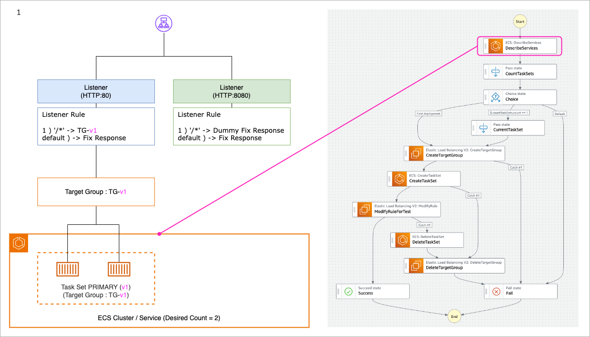
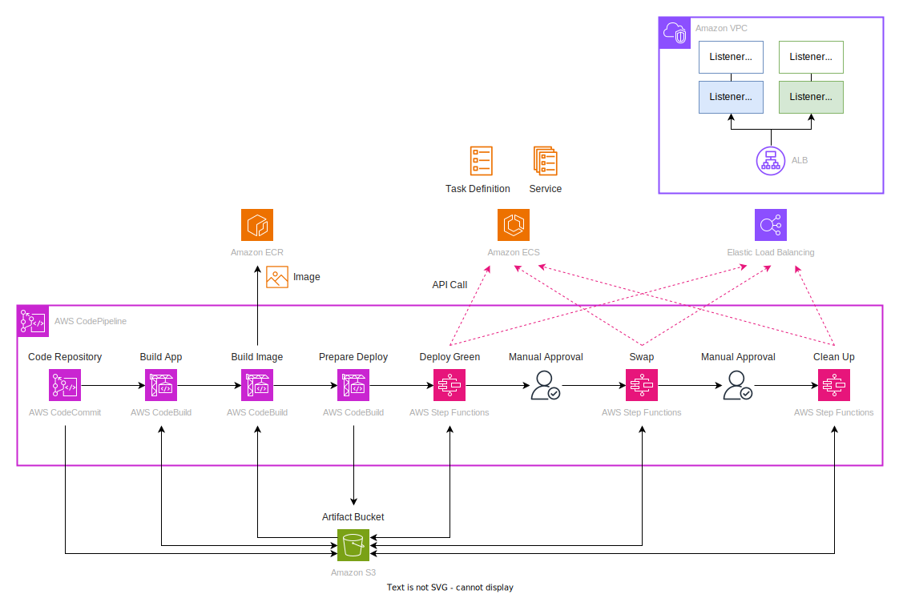
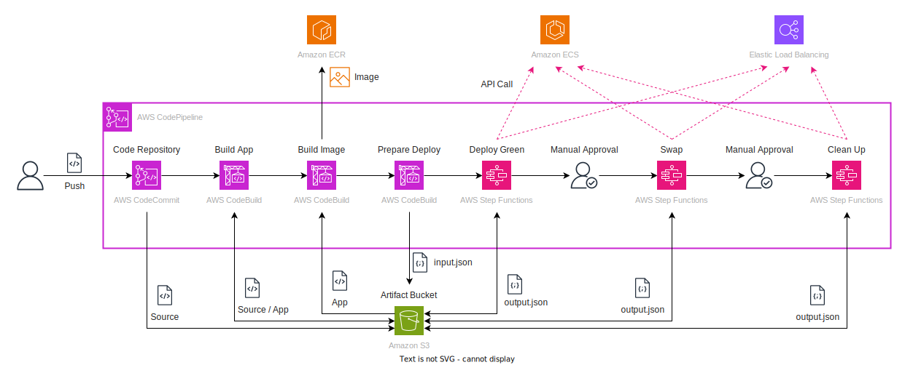
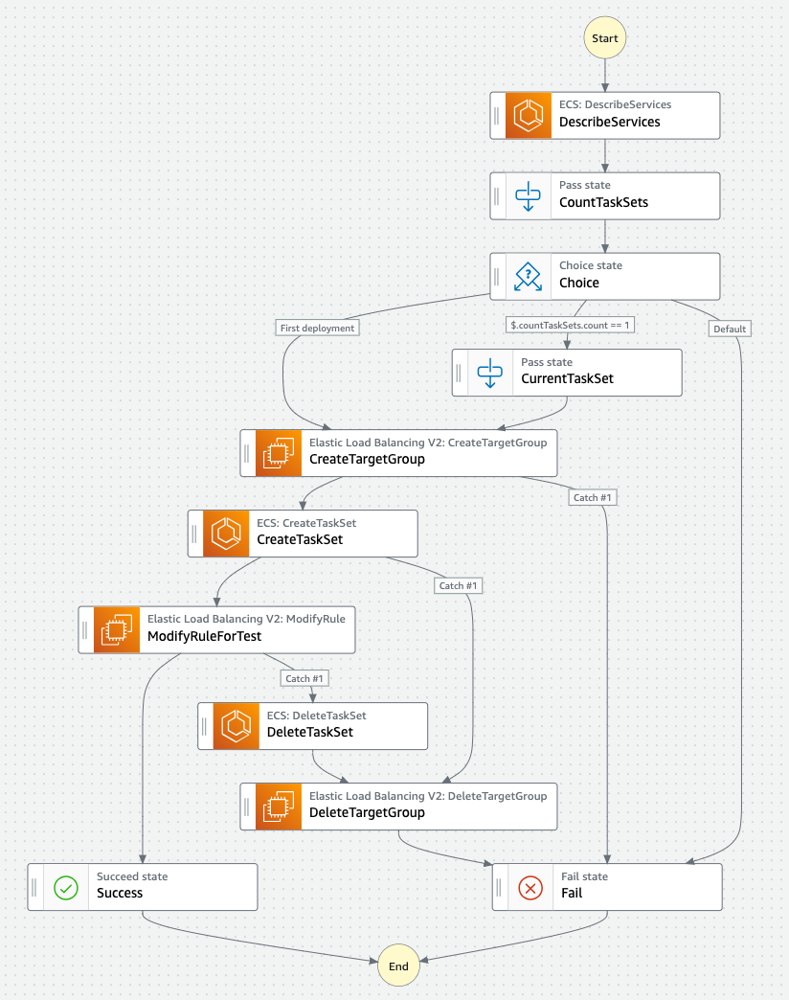
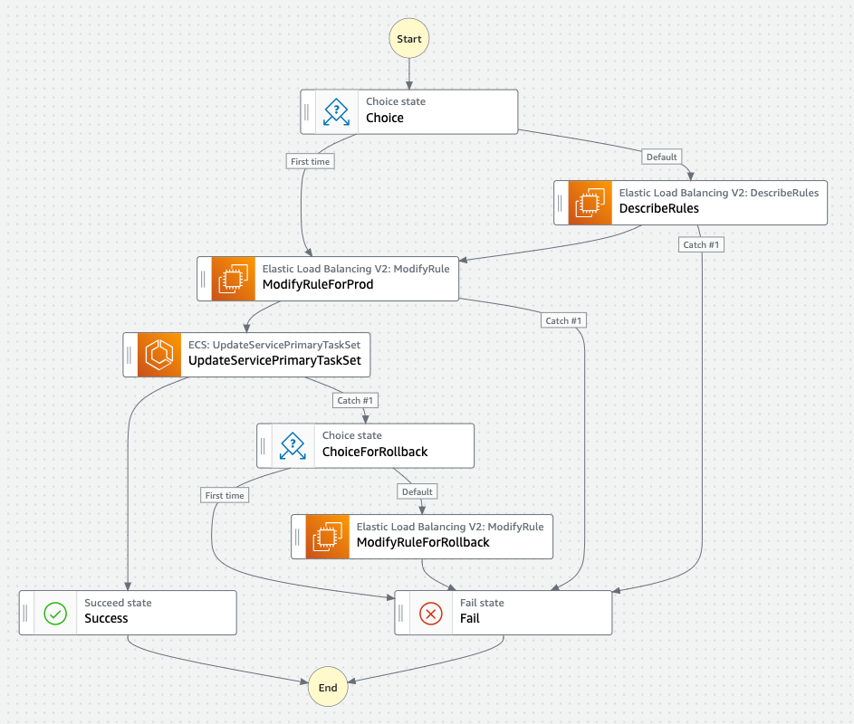
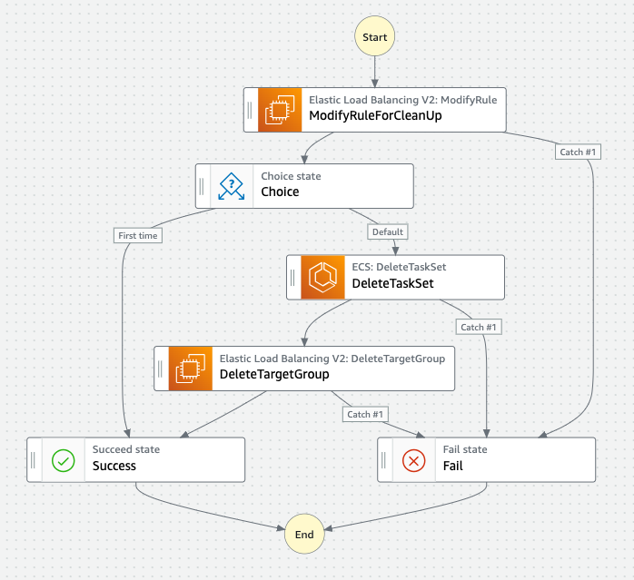

# Demo : ECS Blue/Green Deploy with External Deploy Controller using AWS Step Functions

[日本語の情報(for Japanese)](https://blog.msysh.me/posts/2023/07/demo_app_for_blue_green_deploy_with_ecs_external_deploy_controller_using_step_functions.html)

This project is a demo application that implements a Blue/Green deployment with ECS External Deploy Controller using AWS Step Functions.

## Background

CodeDeploy has capability Blue/Green deployment for Amazon ECS and we can set up CI/CD pipeline also with CodePipeline.
The CodeDeploy B/G deployment allows testing in a Green environment before production release.
However, the test period is only 2 days.
If we want to test longer term than it, we can build custom B/G deployment using **ECS External Deploy Controller**.
This project is a demo application that implements B/G Deploy of ECS by External Deploy Controller using AWS Step Functions.
The test period of the green environment will be kept until approved by manual approval in CodePipeline (up to 7 days).

## B/G deploy demo overview



## How to deploy

All resources for this project are provisioned by the AWS Cloud Development Kit (CDK).
If you have not installed the CDK, first install it by referring to [this document](https://docs.aws.amazon.com/cdk/v2/guide/getting_started.html).

The resources to be deployed are following architecture diagram.


_Icons for IAM Role, Subnets, Security Groups, NAT Gateway and so on are omitted._

### 1. Clone this project

```bash
git clone https://github.com/msysh/aws-demo-blue-green-deploy-with-external-deploy-controller.git
```

### 2. Deploy AWS resources by CDK

```bash
cd aws-demo-blue-green-deploy-with-external-deploy-controller
cdk deploy
```

After completion deployment, you can get following values.
And then please note them.

* CodeCommit repository URL
* ECS Cluster name
* ECS Service name
* Web App URLs for production(:80) and test(:8080)

### 3. Update desired count for ECS Service

In case that deploying ECS Service with External Deployment, the `desired-count` need to be set 0.
Therefore, the desired count is increased to 1 at this time after deployment is complete.

```bash
aws ecs update-service --cluster ${EcsClusterName} --service ${EcsServiceName} --desired-count 1
```

_`${EcsClusterName}` and `${EcsServiceName}` are able to get from CDK Output._

### 4. Add as CodeCommit repository

[assets/demo-app-repository](./assets/demo-app-repository/) is git repository for demo.
Set up it as git repository.

```bash
cd ./assets/demo-app-repository/
git init
git remote add origin ${CodeCommitRepositoryUrl} -m main
```

_`${CodeCommitRepositoryUrl}` is able to get from CDK Output._

## How to play as demonstration

### 1. Push demo app for first commit

```bash
cd assets/demo-app-repository/
git status
git add .
git commit -m "first commit"
git push origin main
```

If you can not push to repository, please check the [documentation](https://docs.aws.amazon.com/ja_jp/codecommit/latest/userguide/setting-up.html).

### 2. Pipeline is triggered

Push commit to the repository, then the pipeline is triggered.
There are some stages that 1)Build app, 2)Build image, 3)Prepare input for state machine, and 4)Deploy to green environment.
These stages are completed and then you may test in a Green environment.

```bash
curl -X GET http://${AlbTestDns}:8080/
```

_`${AlbTestDns}` is able to get from CDK Output._

At this point, the pipeline is waiting for manual approval to swap Blue/Green.

### 3. Approve to swap B/G

Access AWS Management Console and open CodePipeline, and then approve to swap B/G.

### 4. Swap B/G

The pipeline invoke a state machine to swap B/G. It is completed then you may access web app as production.

```bash
curl -X GET http://${AlbProdDns}/
```

_`${AlbProdDns}` is able to get from CDK Output._

At this point, the pipeline is waiting for manual approval to clean up.

### 5. Approve to clean up

Access AWS Management Console and open CodePipeline, and then approve to clean up.

### 6. Clean up

The pipeline invoke state machine to clean up.
It is completed then you will no longer be able to access the test environment and the old production environment will be deleted.

### 7. Deploy new revision

If you want update app and deploy new revision, you can perform following.

```bash
cd assets/demo-app-repository/
sed -i s/background-color:\ \#99c/background-color:\ \#9c9/ index.html

# If you use MacOS, following command
# sed -i '' s/background-color:\ \#99c/background-color:\ \#9c9/ index.html
```
_Change background color from blue to green._

And commit changes and push.

```bash
git add .
git commit -m "change background color"
git push origin main
```

The procedure thereafter is the same as from [step 2](#2-pipeline-is-triggered) above.

## Dive Deep CodePipeline Flow

The pipeline flow is following diagram.



### CodeBuild for Build App

This stage simply embeds the commit ID and build date in the [index.html](./assets/demo-app-repository/index.html) file.

* The buildspec file is [buildspec-app.yml](./assets/demo-app-repository/buildspec-app.yml)
* The resources definition file by CDK is [pipline-stage/build-app.ts](./lib/pipeline-stage/build-app.ts)

### CodeBuild for Build Image

This stage installs the HTML file from the previous stage output into the Nginx container, creates a container image with a [Dockerfile](./assets/demo-app-repository/Dockerfile), and pushes it to the ECR.

* The buildspec file is [buildspec-image.yml](./assets/demo-app-repository/buildspec-image.yml)
* The resources definition file by CDK is [pipeline-stage/build-image.ts](./lib/pipeline-stage/build-image.ts)

### CodeBuild for Prepare Input

This stage creates a JSON file for the input of the next Step Functions State Machine.
The ECS cluster name, ECS service name, ALB Listener ARN, etc. are set as environment variables by CDK in the build project.

* The buildspec file is [buildspec-prepare-deploy-green.yml](./assets/demo-app-repository/buildspec-prepare-deploy-green.yml).
* The resources definition file by CDK is [pipeline-stage/prepare-deploy-green.ts](./lib/pipeline-stage/prepare-deploy-green.ts)

### State Machine Stage for Deploy Green Environment

This stage is a state machine of AWS Step Functions.
The flow diagram is following.



As a major part, invoke following API by SDK.

* Create an ECS Task Set by `ecs:CreateTaskSet`
* Create a Target Group by `elbv2:CreateTargetGroup`
* Modify a Listener Rule for Test environment by `elbv2:ModifyRule`

And definitions are following.

* The Amazon States Language (ASL) file is [deploy-green.asl.json](./assets/state-machine/deploy-green.asl.json)
* The resources definition file by CDK is [pipeline-stage/deploy-green.ts](./lib/pipeline-stage/deploy-green.ts)

### State Machine Stage for Swap

This stage is state machine of AWS Step Functions.
The flow diagram is following.



As a major part, invoke following API by SDK.

* Modify a Listener Rule for Production environment by `elbv2:ModifyRule`
* Change Task Set status from Active to Primary by `ecs:UpdateServicePrimaryTaskSet`

And definitions are following.

* The Amazon States Language (ASL) file is [swap.asl.json](./assets/state-machine/swap.asl.json)
* The resources definition file by CDK is [pipeline-stage/swap.ts](./lib/pipeline-stage/swap.ts)

### State Machine Stage for Clean up

This stage is state machine of AWS Step Functions.
The flow diagram is following.



As a major part, invoke following API by SDK.

* Modify a Listener Rule for Test environment by `elbv2:ModifyRule`
* Delete Task Set by `ecs:DeleteTaskSet`
* Delete Target Group by `elbv2:DeleteTargetGroup`

And definitions are following.

* The Amazon States Language (ASL) file is [clean-up.asl.json](./assets/state-machine/clean-up.asl.json)
* The resources definition file by CDK is [pipeline-stage/clean-up.ts](./lib/pipeline-stage/clean-up.ts)

## Limitations

* Autoscaling is not configured for this project; you will need to disable scale-in before the swap and re-enable it after the swap is complete.
  See also the AWS document: https://docs.aws.amazon.com/AmazonECS/latest/developerguide/service-auto-scaling.html#service-auto-scaling-deployments
* Rollback is also not implemented (e.g., when a swap is not approved) and would involve creating a flow to perform rollback using notifications to the SNS topic.

## Clean up

Some resources in this project will be charged by time, so if you no longer need them, please remove them.

Terminate ECS Tasks

```bash
aws ecs update-service --cluster ${EcsClusterName} --service ${EcsServiceName} --desired-count 0
```

_`${EcsClusterName}` and `${EcsServiceName}` are able to get from CDK Output._

And remove resources by CDK.

```bash
cd ${ThisProjectRoot}
cdk destroy
```

And following resources:

* ECR repository. Repository Uri is able to get as `EcrRepositoryUri` from CDK Output.
* S3 bucket for artifacts. S3 Bucket Name is able to get as `ArtifactBucketName` from CDK Output.
* Target Groups. They are named `tg-{shortened ECS Service name}-{First 15 characters of Commit ID}`

## License

MIT